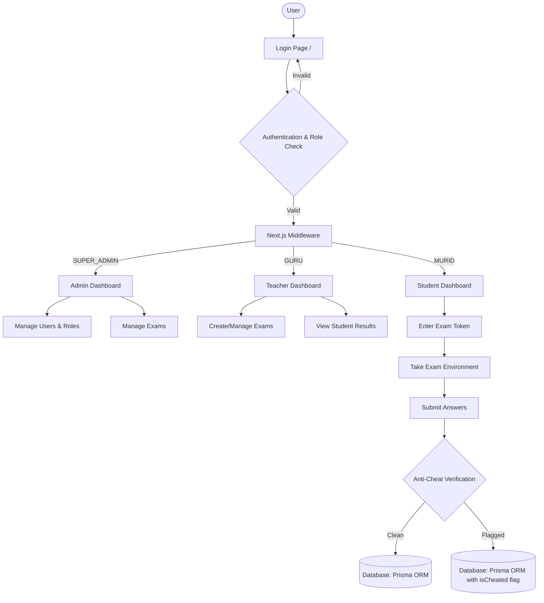

# 🛡️ CleanExam

> **Modern, Secure, and Comprehensive Computer Based Test (CBT) Application**

CleanExam is a powerful, secure, and modern Next.js application designed to facilitate Computer Based Tests (CBT) for schools and institutions. Built with the Next.js App Router and Prisma, CleanExam ensures high performance, seamless user experience, and rigorous cybersecurity standards to maintain academic integrity.

## ✨ Key Features

- **Role-Based Access Control (RBAC):** Distinct dashboards and access levels for `SUPER_ADMIN`, `GURU` (Teacher), and `MURID` (Student).
- **Anti-Cheat Mechanisms:** Monitors test-taking behavior with secure exam tokens and behavioral flags.
- **Modern UI/UX:** Built with Tailwind CSS and Radix UI for an intuitive, accessible, and responsive interface.
- **Robust Database Management:** Powered by Prisma ORM and SQLite (easily configurable to PostgreSQL or MySQL).

## 🔒 Comprehensive Cybersecurity Approach

We take security seriously. CleanExam integrates multiple layers of protection:

1. **Strict Role-Based Routing:** Middleware automatically intercepts and validates access rights, ensuring users can only reach authorized endpoints.
2. **Encrypted Passwords:** User credentials are cryptographically hashed using `bcryptjs`.
3. **Secure HTTP Cookies:** Authentication state is managed via secure, HTTP-only cookies, protecting against XSS-based session hijacking.
4. **HTTP Security Headers:** Next.js configuration enforces strict security headers, including `Content-Security-Policy` (CSP), `X-Frame-Options`, and `Strict-Transport-Security` (HSTS).
5. **No Hardcoded Credentials:** Production-ready authentication flow with zero hardcoded backdoors.

## 📐 System Architecture & Flowchart

The following flowchart illustrates the high-level architecture and access flow within CleanExam:



## 🚀 Getting Started

### Prerequisites
- Node.js 18+
- npm, pnpm, or yarn

### Installation

1. **Clone the repository:**
   ```bash
   git clone https://github.com/yourusername/clean-exam.git
   cd clean-exam
   ```

2. **Install dependencies:**
   ```bash
   npm install
   ```

3. **Set up the database:**
   Ensure you have a `.env` file with your database URL, then run migrations:
   ```bash
   npx prisma migrate dev
   ```

4. **Run the development server:**
   ```bash
   npm run dev
   ```

Open [http://localhost:3000](http://localhost:3000) with your browser to see the result.

## 🤝 Contributing
Contributions, issues, and feature requests are welcome! Feel free to check the [issues page](https://github.com/yourusername/clean-exam/issues).

## 📝 License
This project is [MIT](https://choosealicense.com/licenses/mit/) licensed.